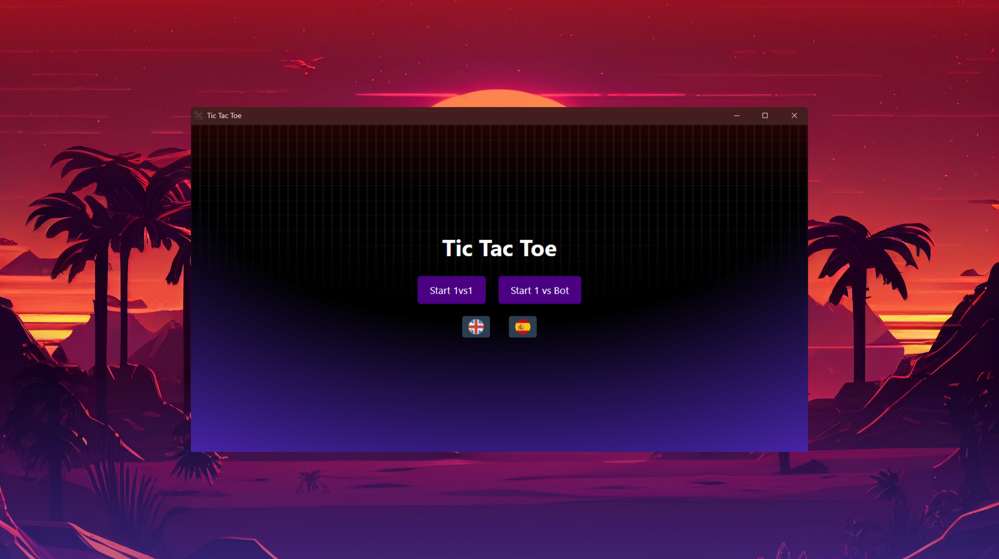

# Tic Tac Toe

Esta es una aplicación de Tic Tac Toe construida con **React**, **Vite**, **Tailwind CSS** y **Redux**. La aplicación presenta un diseño moderno y futurista con una animación de fondo infinita.

## Características

- **Modo 1vs1**: Juega contra otro jugador.
- **Modo 1vsBot**: Juega contra una máquina.
- **Pantalla de Carga**: Una pantalla de carga que transiciona a la pantalla del menú.
- **Pantalla del Menú**: Opciones para iniciar un juego 1vs1 o 1vsBot.
- **Pantalla del Juego**: La interfaz principal del juego con un indicador de turno y un tablero de juego.
- **Diálogo de Fin de Juego**: Muestra el resultado y opciones para reiniciar el juego o volver al menú.
- **Animación de Fondo Infinita**: Un fondo personalizado con un efecto de desplazamiento infinito.

## Capturas de Pantalla

### Pantalla del Menú



### Pantalla de la partida


## Instalación

Para configurar el proyecto localmente, sigue estos pasos:

1. **Clona el repositorio**:
    ```sh
    git clone https://github.com/tu-usuario/tic-tac-toe.git
    cd tic-tac-toe
    ```

2. **Instala las dependencias**:
    ```sh
    npm install
    ```

3. **Inicia el servidor de desarrollo**:
    ```sh
    npm run dev
    ```

4. **Abre la aplicación**:
    Abre tu navegador y navega a `http://localhost:3000` para ver la aplicación.

## Estructura del Proyecto

La estructura del proyecto es la siguiente:

```plaintext
tic-tac-toe/
├── node_modules/
├── public/
│   └── index.html
├── src/
│   ├── components/
│   │   ├── GameScreen.jsx
│   │   ├── LoadingScreen.jsx
│   │   └── MenuScreen.jsx
│   ├── store/
│   │   ├── gameSlice.js
│   │   └── store.js
│   ├── App.jsx
│   ├── index.css
│   └── main.jsx
├── tailwind.config.js
├── postcss.config.js
├── package.json
└── README.md
 ```
## Tecnologías Utilizadas
- React: Una biblioteca de JavaScript para construir interfaces de usuario.
- Vite: Una herramienta de construcción que busca proporcionar una experiencia de desarrollo más rápida y ligera para proyectos web modernos.
- Tailwind CSS: Un framework de CSS de utilidad primero para construir rápidamente interfaces de usuario personalizadas.
- Redux: Una biblioteca de JavaScript para la gestión del estado de la aplicación.
## Personalizaciones
## Animación de Fondo
La animación de fondo se logra utilizando keyframes de CSS y utilidades de Tailwind CSS. La capa de fondo se desplaza infinitamente hacia la izquierda, creando un efecto de movimiento continuo.

## Familia de Fuentes
La familia de fuentes personalizada se aplica utilizando la extensión de tema de Tailwind CSS. La familia de fuentes está configurada en un estilo moderno y futurista.

## Contribuciones
¡Las contribuciones son bienvenidas! Por favor, abre un issue o envía un pull request si tienes alguna sugerencia o mejora.

## Licencia
Este proyecto está bajo la Licencia MIT.

